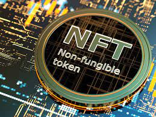
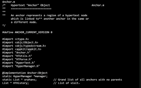
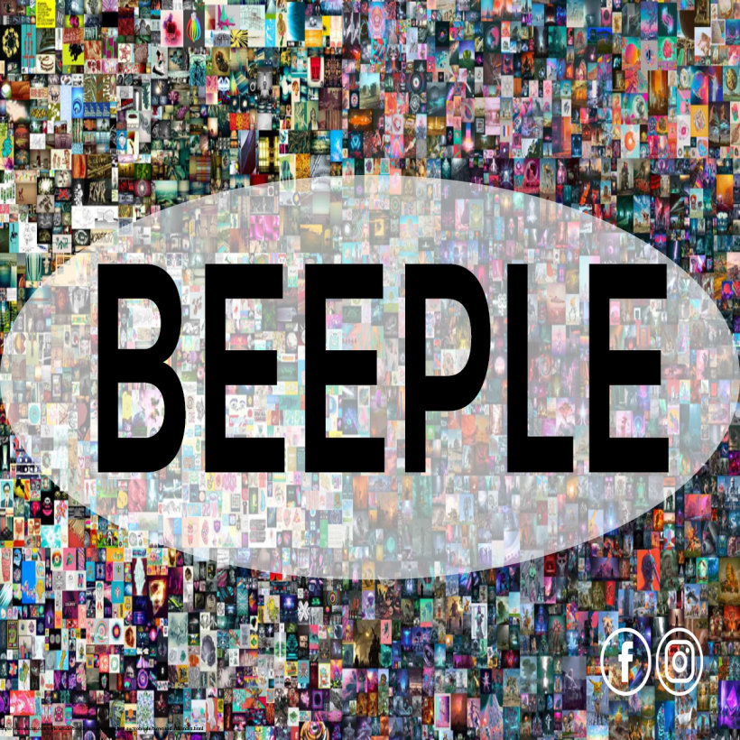

# **Let's Put the "Fun" in Non-Fungible Tokens**

```
Project 1 - Group 3
Presentation Date: November 6, 2021
Prepared by: Andrew Crawford, Sam Kohnle, Rachel Pierce, Jinhyeong Park
```

#

## Project Title:
Let's Put the "Fun" in Non-Fungible Tokens

#

## Project Team Members:
- Andrew Crawford
- Sam Kohnle
- Rachel Pierce
- Jinhyeong Park

#

## Project Description/Outline:

Our project is to research and learn patterns and trends in Non-Fungible Tokens (NFTs) in order to determine if it would be beneficial to invest in NFTs.  We will be using the OpenSea API to retrieve data regarding NFTs to determine the following:
- What are NFTs?
- What are the financial trends?
- How profitable are NFTs?

#

## Datasets Used:
We will be using data obtained from the OpenSea API and Ethereum API.
- https://docs.opensea.io/reference/api-overview
- https://api.alternative.me/v2/ticker/Ethereum/?convert=CAD

#

## Brief Background of NFTs:
What are NFTs?
- NFTs, or nonfungible tokens, are unique assets that can’t be replaced with something else, and are verified and stored using blockchain technology.  They can include everything from music to a website domain, but the current craze is really around digital artwork. The market exceeded $10B in transaction volume as of 3Q2021.  

      

Examples of Recently Sold NFTs:
- The NFT art scene has exploded in recent months, with some of the most expensive NFT sales conducted in the last six months.  A few examples include: CryptoPunk #7523 ($11.8 million), CryptoPunk #7804 ($7.56 million), Ocean Front ($6 million), and the World Wide Web source code ($5.43 million).  

    
    
    
      
  

    
Minting and Purchasing an NFT:
- For NFTs to become valuable and scarce they have to be minted. The term minting in NFTs is similar to minting a coin of silver. Once an NFT is minted on the Ethereum blockchain it becomes unchangeable and tamper-proof. Newly minted NFTs then are able to be sold on third party websites. These websites include Nifty Gateway, Zora, and OpeanSea to name a few.  For a buyer to purchase an NFT they have to purchase the NFT using Ethereum Tokens.  Other blockchain networks that mint NFTs beside Ethereum include Solana, Polygon, and Binance Smart Chain, to name a few. Yet Ethereum reigns supreme for NFTs on chain.

The Rise of NFTs:
- NFTs have only been around for a little over a half a decade so they have not become commonplace in today’s society. Yet the NFT space has gained some notoriety this past year due to the fact that massive amounts of money have been allocated to purchase some NFT projects. The vast majority of people in the NFT space, which are the artists and buyers, are between the ages of 18-39.  
  
    

#

##  Data and Research Questions:
Based on our analysis of the data included in the OpenSea API, we refined our data visualizations to the following achievable results.  The data was broken apart into exploration, cleanup, and analysis phases as seen in the JupyterLab notebooks.  Refer to the **Dataprep.ipynb** and **Visualizations.ipynb** files in GitHub for code details, and the **Dashboard_Presentation.html** for the full presentation (including narratives and visualizations).  Visualizations and conclusions included in the project are as follows, which helped us to learn about the NFT market.
1. NFT Bid Trends
    - This visual provided our group with the trends in NFT bid prices from 2018-2021. As you can see by the graph, bids have periodic jumps throughout the year, most notably in November and December 2020, and April, June, August, September, and October. They are sporadic and there does not appear to be seasonality or obvious trends.
2. Number of NFT Sales Per Day
    - This visual provided our group with the number of NFT sales per day. You can see jumps in sales periodically throughout the year, with the most significant jump in June of 2021. Again, these seem sporadic with no obvious trends.
3. Volume of Sales Per Day
    - This visual provided our group with volume of sales per day, rather than count of sales per day as shown in the prior visual. As seen in the graph, there are several timeframes with higher than normal sales volume, including November 2020, June 2021, August 2021, and September 2021.
4. Number of Sales Per Token ID
    - This visual provided our group with the top 10 most expensively priced NFT projects. As of 11/4/2021, the most expensive bids are between 569 to 79 (which varies per minute as data is updated). The constantly changing bid prices indicate these assets are not stable.
5. Top 10 Bids
    - This visual provided our group with number of sales per token ID. As you can see by the visual above, most tokens sell around 2 times or less. However, there is one token that has sold more times than all others (5 times).
6. Total Buyers/Sellers
    - This visual provided our group with the total amount of NFT Buyers and Sellers. As you can see, there are currently more buyers of NFTs than there are sellers, making it a sellers market.
7. Top 5 NFT Projects by Market Cap
    - This visual provided our group with the top 5 NFT projects by Market Cap. CryptoPunks far exceeds all other projects, at almost 1200000 ETH.

#

## Overall Dashboard:
We combined all visualizations as well as narratives into a dashboard for our presentation. Please refer to the **Dashboard_Presentation.html** in GitHub for the document.

#

## Rough Breakdown of Tasks Completed:
- Narrative sections - Sam and Rachel
- Research and Visualization #1 - Rachel
- Research and Visualization #2 - Jinhyeong
- Research and Visualization #3 - Jinhyeong
- Research and Visualization #4 - Andrew
- Research and Visualization #5 - Sam
- Research and Visualization #6 - Andrew
- Research and Visualization #7 - Sam
- Dashboard - Rachel
- Readme preparation - Rachel
- Presenter -  Rachel (Lead), Others (Assist)
#

## Additional Notes:
We requested API access on 10/28/21 from OpenSea.  Message request: "Requesting access to API for University of MN Fintech Bootcamp Project involving API use and NFT research.  Will use OpenSea financial data to analyze trends in NFT sales and predict future activity."  We never received access, so data obtained for this project is based on the public API data.

#

## Workpapers in GitHub
Please refer to the following workpapers in GitHub:
- This **ReadMe** file (Includes a summary of the project)
- **Dashboard_Presentation.html** (From 11/6/21 Class Presentation)
- **Dataprep.ipynb** file (Includes data exploration and cleanup)
- **Visualizations.ipynb** file (Includes data analyses)
- **Project1 Spyder Code File** (Includes the code we used in Spyder to drill down to data variables we wanted to use)
- **Images** folder (Includes png files of visualizations)
#


## References:

- [OpenSea API Page](https://docs.opensea.io/reference/api-overview)
- [Ethereum API Page](https://api.alternative.me/v2/ticker/Ethereum/?convert=CAD)
- [DataMining Article](http://adilmoujahid.com/posts/2021/06/data-mining-meebits-nfts-python-opensea/)
- [CNBC Article on NFTs](https://www.cnbc.com/2021/10/16/what-are-nfts-heres-what-you-need-to-know-about-non-fungible-tokens.html)
- [Market Cap Rankings](https://opensea.io/rankings)
- [Mining NFT Artcle](https://help.foundation.app/en/articles/4742869-a-complete-guide-to-minting-an-nft)  

#


